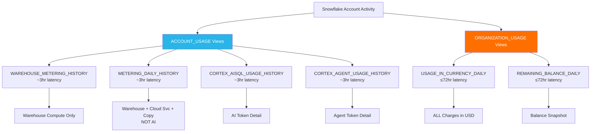

# Snowflake Cost Control Guide: The Complete Truth

[](https://www.snowflake.com/)
[]()
[](LICENSE)

> A practical guide based on real experience and verified with Snowflake Support — for students and learners managing trial and paid accounts.

---

## Table of Contents

- [Two Accounts, Two Different Experiences](#two-accounts-two-different-experiences)
- [What Snowflake Support Confirmed](#what-snowflake-support-confirmed-march-2026--verified-in-writing)
- [What Happens When You Add a Payment Method](#what-happens-when-you-add-a-payment-method)
- [What Consumes Trial Credits](#what-consumes-trial-credits-only-when-actively-used)
- [Architecture](#architecture)
- [Repository Structure](#repository-structure)
- [View Latency Quick Reference](#view-latency-quick-reference)
- [Precautions Checklist](#precautions-checklist-review-regularly)
- [Cost Control Setup](#cost-control-setup-run-once)
- [Credit Monitoring Queries](#credit-monitoring-queries-run-weekly)
- [How to Discontinue After Trial](#how-to-discontinue-after-trial)
- [Safety Net: Refund Process](#safety-net-refund-process)
- [Key Lessons Learned](#key-lessons-learned)
- [Suggestions Submitted to Snowflake](#suggestions-submitted-to-snowflake-product-team)
- [Quick Start](#quick-start)
- [Prerequisites](#prerequisites)
- [Useful Links](#useful-links)
- [Author](#author)
- [License](#license)

---

## Two Accounts, Two Different Experiences

### Account 1 (Paid/Converted Account — Feb 2026)
| Metric | Value |
|--------|-------|
| Starting Balance | $312.92 |
| Balance After 3 Days | $201.43 |
| **Total Lost** | **$111.49 (36%)** |
| Peak Single Day Cost | $79.89 (Feb 23) |
| Visible in ACCOUNT_USAGE? | **Yes** — CORTEX_AGENT_USAGE_HISTORY |

### Account 2 (Trial Account — March 2026)
| Metric | Value |
|--------|-------|
| Original Credit Allocation | 400 credits |
| Trial End Date | **June 23, 2026** |
| Cortex Code message | "10 credits reached" daily cap |
| Visible in ACCOUNT_USAGE? | **No** — internal rate limiter only |
| Credits actually deducted? | **No** |

---

## What Snowflake Support Confirmed (March 2026) — Verified in Writing

| Question | Official Answer |
|----------|----------------|
| Is Cortex Code free? | **Yes** — GA and free. AI token costs absorbed by Snowflake. Advance notice will be given before any billing is introduced. |
| Are the 10.36 credits deducted from trial balance? | **No** — internal usage tracking for rate limiter only |
| Does it show in ACCOUNT_USAGE views? | **No** — tracked internally, not in METERING_DAILY_HISTORY |
| Will adding a credit card charge me? | **No** — trial credits consumed first for ALL features |
| Will adding a card end my trial? | **No** — trial period unchanged |
| Does any feature bypass trial credits and charge card directly? | **No** — all features use trial credits first |
| Can I get a refund if unexpected charge occurs? | **Yes** — open a support case, Snowflake will review and refund if made in error |
| Does seeing a feature (e.g. OpenFlow) in menu cost anything? | **No** — only active usage consumes credits |
| Trial duration after adding card? | **Unchanged** — verified as June 23, 2026 |
| Can credit card be removed without closing account? | **No** — must contact Support to close account entirely |

---

## What Happens When You Add a Payment Method

| Action | Result |
|--------|--------|
| Trial converts to paid account | Yes |
| Trial period ends | **No** — trial continues (confirmed: June 23, 2026) |
| Trial credit allocation changes | **No** — remains 400 credits |
| Daily 10-credit cap lifted | **Yes** |
| Card charged immediately | **No** |
| Card charged during trial | **No** — all features use trial credits first |
| Card charged after trial ends | **Yes**, for any ongoing usage |
| Trial balance tile disappears from sidebar | **Yes** — expected behavior after conversion |
| Premium features become visible | **Yes** — but no charges unless actively used |
| Can remove card after adding | **No** — only "Replace" available. Must contact Support to close account. |

---

## What Consumes Trial Credits (Only When Actively Used)

| Feature | Credits Consumed? | Notes |
|---------|------------------|-------|
| Warehouse compute | Yes | Running queries, loading data |
| Serverless features | Yes | Snowpipe, auto-clustering, search optimization, Tasks |
| OpenFlow | Yes | Only if you create AND run a connector |
| Storage | Yes | Data stored in tables |
| Cortex AI Functions | Yes | AI_COMPLETE, AI_SUMMARIZE, etc. |
| Cortex Code | **FREE** | No credits consumed, no card charged |
| Browsing menus/features | **FREE** | Simply seeing a feature costs nothing |
| Trust Center scanners | Yes | CIS Benchmarks & Threat Intelligence run silently — disable them! |

---

## Architecture

### Cost Monitoring Data Flow



### ASCII Version

```
┌──────────────────────────────────────────────────────────────────────┐
│                   Snowflake Account Activity                         │
└────────────────────┬─────────────────────────┬───────────────────────┘
                     │                         │
        ┌────────────▼──────────┐   ┌─────────▼───────────────┐
        │   ACCOUNT_USAGE       │   │   ORGANIZATION_USAGE     │
        │   (~3 hr latency)     │   │   (≤72 hr latency)       │
        └────────────┬──────────┘   └─────────┬───────────────┘
                     │                         │
    ┌────────────────┼────────────┐    ┌───────┼──────────┐
    │                │            │    │                   │
    ▼                ▼            ▼    ▼                   ▼
 WAREHOUSE      METERING     CORTEX   USAGE_IN        REMAINING
 _METERING      _DAILY       _AISQL   _CURRENCY       _BALANCE
 _HISTORY       _HISTORY     _USAGE   _DAILY          _DAILY
                             _HISTORY
    │                │            │    │                   │
    ▼                ▼            ▼    ▼                   ▼
 Warehouse     WH+Cloud+     AI       ALL charges     Balance
 compute       Copy only     tokens   in USD          snapshot
 ONLY          (NOT AI)      ONLY     (complete)      (EOD)
```

---

## Repository Structure

```
cortex-code-cost-guide/
├── README.md                          # This file — findings, verified facts, monitoring queries
├── SNOWFLAKE_COST_CONTROL_GENERIC.md  # Comprehensive cost control guide (warehouses, budgets, queries)
├── SNOWFLAKE_SUPPORT_TICKET.md        # Support ticket reference and case resolution
├── LINKEDIN_POST.md                   # LinkedIn post for publishing
├── SCREENSHOT_GUIDE.md                # Screenshot instructions for GitHub/LinkedIn
├── cost_analysis_queries.sql          # All monitoring queries + view latency cheat sheet
├── cost_control_generic.sql           # Setup + monitoring + silent consumers + emergency actions
├── LICENSE                            # MIT License
└── .gitignore                         # Git ignore rules
```

---

## View Latency Quick Reference

| View | Latency | Covers |
|------|---------|--------|
| `WAREHOUSE_METERING_HISTORY` | ~3 hrs | Warehouse compute only |
| `METERING_DAILY_HISTORY` | ~3 hrs | Warehouse + cloud svc + copy (NOT AI) |
| `CORTEX_AISQL_USAGE_HISTORY` | ~3 hrs | Cortex AI tokens only |
| `CORTEX_AGENT_USAGE_HISTORY` | ~3 hrs | Cortex Agent tokens only |
| `USAGE_IN_CURRENCY_DAILY` | ≤72 hrs | **Everything** in USD |
| `REMAINING_BALANCE_DAILY` | ≤72 hrs | End-of-day balance |

> If last 2-3 days show $0, that's normal latency — not zero spend. Cross-check with ~3hr views.

---

## Precautions Checklist (Review Regularly)

- [ ] Monitor remaining credits weekly — run monitoring queries below
- [ ] Keep ALL warehouse AUTO_SUSPEND at 60 seconds (minimum recommended)
- [ ] Suspend ALL warehouses when not in use
- [ ] Disable Trust Center scanners (CIS Benchmarks & Threat Intelligence)
- [ ] Do NOT create OpenFlow connectors
- [ ] Do NOT enable Snowpipe, auto-clustering, or search optimization unless intended
- [ ] Check for auto-clustering on tables
- [ ] Check for scheduled Tasks consuming serverless credits
- [ ] Set up resource monitor with alerts
- [ ] Set up account budget for full-coverage spending limit (covers AI, serverless, storage)
- [ ] Set a calendar reminder for late May 2026 (before trial ends June 23)
- [ ] Contact Support to close account if you want to stop before trial ends

---

## Cost Control Setup (Run Once)

```sql
USE ROLE ACCOUNTADMIN;

SHOW WAREHOUSES;
ALTER WAREHOUSE COMPUTE_WH SET AUTO_SUSPEND = 60 AUTO_RESUME = TRUE;
ALTER WAREHOUSE COMPUTE_WH SET WAREHOUSE_SIZE = 'XSMALL';
ALTER WAREHOUSE COMPUTE_WH SET STATEMENT_TIMEOUT_IN_SECONDS = 1800;

CREATE OR REPLACE RESOURCE MONITOR daily_credit_monitor
  WITH
    CREDIT_QUOTA = 5
    FREQUENCY = DAILY
    START_TIMESTAMP = IMMEDIATELY
    NOTIFY_USERS = (SFTRAINING)
    TRIGGERS
      ON 50 PERCENT DO NOTIFY
      ON 75 PERCENT DO NOTIFY
      ON 100 PERCENT DO NOTIFY;

ALTER ACCOUNT SET RESOURCE_MONITOR = daily_credit_monitor;

CALL SYSTEM$TRUST_CENTER_DISABLE_SCANNER_PACKAGE('CIS Benchmarks');
CALL SYSTEM$TRUST_CENTER_DISABLE_SCANNER_PACKAGE('Threat Intelligence');

SELECT TABLE_CATALOG, TABLE_SCHEMA, TABLE_NAME, AUTO_CLUSTERING_ON
FROM SNOWFLAKE.ACCOUNT_USAGE.TABLES
WHERE AUTO_CLUSTERING_ON = 'YES';
```

---

## Credit Monitoring Queries (Run Weekly)

### Daily Credit Consumption (Recommended by Support)
```sql
SELECT USAGE_DATE, USAGE_TYPE, CURRENCY, USAGE, USAGE_IN_CURRENCY
FROM SNOWFLAKE.ORGANIZATION_USAGE.USAGE_IN_CURRENCY_DAILY
WHERE USAGE_DATE >= DATEADD('day', -30, CURRENT_DATE())
ORDER BY USAGE_DATE DESC;
```

### Check Remaining Balance
```sql
SELECT date, free_usage_balance AS balance_usd,
    ROUND(LAG(free_usage_balance) OVER (ORDER BY date) - free_usage_balance, 2) AS daily_spend_usd
FROM SNOWFLAKE.ORGANIZATION_USAGE.REMAINING_BALANCE_DAILY
ORDER BY date DESC LIMIT 30;
```

### Check All Service Types Consuming Credits
```sql
SELECT SERVICE_TYPE, USAGE_DATE, CREDITS_USED, CREDITS_BILLED
FROM SNOWFLAKE.ACCOUNT_USAGE.METERING_DAILY_HISTORY
WHERE USAGE_DATE >= CURRENT_DATE - 7 AND CREDITS_USED > 0
ORDER BY USAGE_DATE DESC, CREDITS_USED DESC;
```

### Credit Usage by Warehouse
```sql
SELECT warehouse_name, ROUND(SUM(credits_used), 4) AS total_credits
FROM SNOWFLAKE.ACCOUNT_USAGE.WAREHOUSE_METERING_HISTORY
WHERE start_time >= DATEADD('day', -7, CURRENT_TIMESTAMP())
GROUP BY warehouse_name
ORDER BY total_credits DESC;
```

### Check Cortex AI Usage (if any)
```sql
SELECT USAGE_TIME, FUNCTION_NAME, MODEL_NAME, TOKENS, TOKEN_CREDITS
FROM SNOWFLAKE.ACCOUNT_USAGE.CORTEX_AISQL_USAGE_HISTORY
WHERE USAGE_TIME >= DATEADD('hour', -24, CURRENT_TIMESTAMP())
ORDER BY USAGE_TIME DESC;
```

---

## How to Discontinue After Trial

| Option | How | Effect |
|--------|-----|--------|
| Close the account | Contact Snowflake Support — no self-service option | Account closed, card removed, no future charges |
| Let trial expire (no card) | Do nothing | Account suspended, no charges |
| Let trial expire (card added) | **Risky** — card will be charged for ongoing usage | Must contact Support to close before June 23, 2026 |

**Important**: Once a credit card is added, it **cannot be removed** without closing the account. The only UI option is "Replace Credit Card."

---

## Safety Net: Refund Process

If you ever see an unexpected charge on your credit card:
1. Open a Snowflake Support case
2. Request a refund with details of the unexpected charge
3. Support will review and process a refund if it was made in error

This was confirmed in writing by Snowflake Support (March 2026).

---

## Key Lessons Learned

1. The "10 credits reached" message is a **rate limiter**, not real billing — trial credits are safe
2. Adding a credit card lifts the cap but **permanently locks the card** — cannot be removed without closing account
3. Trial balance tile **disappears** from sidebar after adding card — must use SQL to monitor
4. All features use **trial credits first** — card only charged after credits exhausted or trial ends
5. OpenFlow and other premium features become **visible** after adding card but cost nothing unless actively used
6. Trust Center scanners run **silently** and consume serverless credits — disable CIS Benchmarks and Threat Intelligence
7. Cortex Code is **free** — useful learning tool for students exploring Snowflake

---

## Suggestions Submitted to Snowflake Product Team

(Forwarded by Support to product team — March 2026)

1. Allow credit card removal without closing the entire account
2. Give users the choice: "Upgrade now" vs "Upgrade after trial ends"
3. Keep premium features disabled on trial accounts even after adding a card
4. Deduct Cortex Code usage from trial credits instead of a hard daily cap

---

## Quick Start

1. Run the **Cost Control Setup** SQL block above (one-time)
2. Run **Credit Monitoring Queries** weekly to track spend
3. Refer to `cost_analysis_queries.sql` for detailed analysis with view latency awareness
4. Refer to `cost_control_generic.sql` for emergency actions and query optimization
5. See `SNOWFLAKE_COST_CONTROL_GENERIC.md` for the full cost control reference guide

---

## Prerequisites

- Snowflake account (trial or paid)
- `ACCOUNTADMIN` role access
- `COMPUTE_WH` warehouse (or equivalent)

---

## Useful Links

- [Snowflake Trial Account Docs](https://docs.snowflake.com/en/user-guide/admin-trial-account)
- [Cortex Code Documentation](https://docs.snowflake.com/en/user-guide/cortex-code/cortex-code)
- [Contacting Snowflake Support](https://docs.snowflake.com/en/user-guide/contacting-support)
- [Snowflake Service Consumption Table](https://www.snowflake.com/legal-files/CreditConsumptionTable.pdf)

---

## Author

**Malaya Kumar Padhi**  
Senior Solution Architect | Data & AI Platforms

[](https://www.linkedin.com/in/mkpadhi/)

---

## License

This project is licensed under the MIT License - see the [LICENSE](LICENSE) file for details.

---

**Disclaimer**: Information verified with Snowflake Support in writing (March 2026). Policies may change — always verify with Snowflake documentation or support.

**Author:** [Malaya Kumar Padhi](https://www.linkedin.com/in/mkpadhi/) | Senior Solution Architect — Data & AI Platforms  
*Part of the [Snowflake Cost Control Guide](https://github.com/Techy-Malay/cortex-code-cost-guide) series.*
